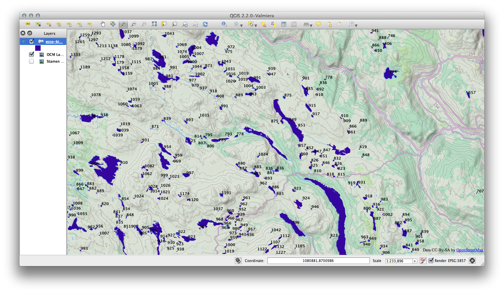

# kojitominaga.github.io
Koji's portfolio

# Projects

## Climeate change impacts on Northern Europe lake ice dynamics

### Problem statement

Lakes in Scandinavia and Finland historically freeze up during the winter as part of the important annual ecological process. Scientists are concerned about the future disruption in these annual dynamics, e.g., no ice-cover entire winter. I was tasked to quantitatively predicted physical changes, for 270,000 lakes in the region. 

### Technical challenge

Combining various datasets (high spatial resolution meteorological scenarios, terrain digital elevation models, in-house lake depth models) had to be extracted, normalised for processing by a physical model. The computational load 10,000 core-hours per scenario, necessitating distributed computing in AWS, and task orchestration. The resulting thermal profile over 100 years mounted to terabytes of data. I load the results to a PostGIS (PostgreSQL with computational geometry) for scientific insights. 

